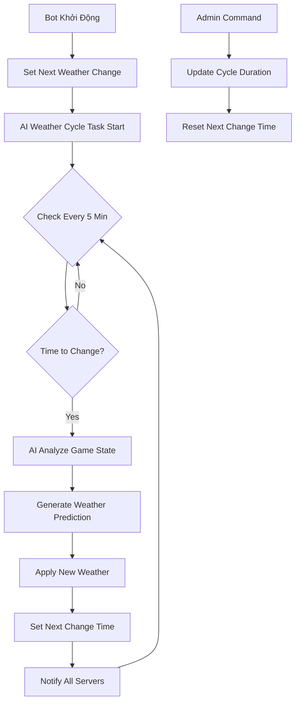

# Triển Khai Hệ Thống Chu Kỳ Thời Tiết AI Tự Động

## 🎯 Mục Tiêu
Xây dựng hệ thống AI thay đổi thời tiết tự động theo chu kỳ cố định (mặc định 1 giờ) để tăng tính tương tác và chiến lược trong game nông trại.

## ✨ Tính Năng Đã Triển Khai

### 1. Task Tự Động Thay Đổi Thời Tiết
- **Chu kỳ mặc định**: 1 giờ (3600 giây)
- **Tần suất kiểm tra**: Mỗi 5 phút
- **AI Logic**: Sử dụng WeatherPredictorAI để phân tích game state và chọn thời tiết tối ưu

```python
@tasks.loop(minutes=5)
async def ai_weather_cycle_task(self):
    # Kiểm tra nếu đã đến thời gian thay đổi
    if datetime.now() >= self.next_weather_change:
        # Áp dụng AI weather prediction
        # Thông báo cho tất cả server
        # Cập nhật thời gian thay đổi tiếp theo
```

### 2. Thông Báo Thay Đổi Thời Tiết AI
- **Kênh thông báo**: Tất cả server đã setup weather notification
- **Nội dung**: Thời tiết cũ → mới, hiệu ứng, lý do AI, thời gian tiếp theo
- **Thiết kế**: Embed màu tím (#9b59b6) để phân biệt với thông báo thời tiết thường

### 3. Cập Nhật Lệnh `f!weather`
- **Thông tin AI hiện tại**: Hiển thị thời tiết AI đang áp dụng + độ tin cậy
- **Countdown**: Thời gian còn lại đến chu kỳ thay đổi tiếp theo
- **Format**: "Sau Xh Ym (HH:MM DD/MM)"

### 4. Lệnh Admin `f!weathercycle`
- **Xem trạng thái**: Chu kỳ hiện tại, thời gian tiếp theo, thời tiết AI hiện tại
- **Điều chỉnh chu kỳ**: Admin có thể đổi từ 30 phút đến 480 phút (8 giờ)
- **Validation**: Đảm bảo game balance với giới hạn hợp lý

## 🔧 Cấu Trúc Code

### Biến Trạng Thái
```python
self.next_weather_change = None  # Thời điểm thay đổi tiếp theo
self.weather_change_duration = 3600  # Chu kỳ (giây)
self.current_weather = None  # Thời tiết hiện tại với metadata AI
```

### Task Management
```python
# Khởi động trong __init__
self.ai_weather_cycle_task.start()

# Cleanup trong cog_unload
self.ai_weather_cycle_task.cancel()
```

### AI Integration
- **WeatherPredictorAI**: Phân tích game state (player satisfaction, economy, activity)
- **Smart Prediction**: Dựa trên pattern và context để chọn thời tiết phù hợp
- **Reasoning**: AI cung cấp lý do tại sao chọn thời tiết này

## 📊 Luồng Hoạt Động



## 🎮 Hiệu Ứng Game

### Chiến Lược Người Chơi
- **Dự đoán**: Sử dụng `f!aiweather` để dự đoán thời tiết tiếp theo
- **Timing**: Lên kế hoạch trồng/thu hoạch dựa trên chu kỳ
- **Risk Management**: Cân nhắc thời tiết xấu có thể xảy ra

### AI Balance
- **Player Satisfaction**: AI giúp đỡ khi người chơi gặp khó khăn
- **Challenge Mode**: Tăng độ khó khi người chơi quá mạnh
- **Recovery Boost**: Pattern đặc biệt để phục hồi engagement

## 🔨 Lệnh Mới

### `f!weathercycle` (Admin Only)
```bash
# Xem trạng thái
f!weathercycle

# Đổi chu kỳ thành 60 phút
f!weathercycle 60

# Đổi chu kỳ thành 2 giờ
f!weathercycle 120
```

**Giới hạn:**
- Tối thiểu: 30 phút (game balance)
- Tối đa: 480 phút / 8 giờ (engagement)

### Cập Nhật `f!weather`
- ➕ Thông tin thời tiết AI hiện tại
- ➕ Countdown đến thay đổi tiếp theo
- ➕ Metadata độ tin cậy AI

## 🔮 Thông Báo Tự Động

### Format Thông Báo AI Weather
```
🤖 AI đã thay đổi thời tiết!
Hệ thống AI đã phân tích và điều chỉnh thời tiết game

🔄 Thay đổi thời tiết: ☀️ Nắng ➜ 🌧️ Mưa
⚡ Hiệu ứng mới: Tốc độ 110% | Sản lượng 115%
⏰ Thời tiết tiếp theo: Sau 0h 58m (15:30 12/01)
🧠 Lý do AI: Người chơi cần hỗ trợ sản lượng...
```

## 🚀 Triển Khai

### Bước 1: Khởi Động Hệ Thống
```python
# Task tự động bắt đầu khi bot ready
await bot.add_cog(WeatherCog(bot))
```

### Bước 2: Setup Thông Báo (Optional)
```bash
# Server muốn nhận thông báo thay đổi thời tiết AI
f!setupweather #weather-channel
```

### Bước 3: Điều Chỉnh Chu Kỳ (Admin)
```bash
# Mặc định 60 phút, có thể điều chỉnh
f!weathercycle 90  # Đổi thành 1.5 giờ
```

## 🎯 Lợi Ích

### Cho Người Chơi
1. **Predictability**: Biết khi nào thời tiết sẽ thay đổi
2. **Strategy**: Lên kế hoạch dài hạn cho farming
3. **Engagement**: Luôn có lý do để quay lại check game

### Cho Game Master
1. **Control**: Điều chỉnh tần suất thay đổi theo cần thiết
2. **Balance**: AI tự động cân bằng game state
3. **Monitoring**: Xem được pattern và hiệu quả AI

### Cho Hệ Thống
1. **Automation**: Không cần manual intervention
2. **Intelligence**: AI học và thích ứng với player behavior
3. **Scalability**: Hoạt động tốt với nhiều server cùng lúc

## 📈 Tối Ưu Hóa

### Performance
- Task chỉ chạy mỗi 5 phút (lightweight)
- AI prediction cache để tránh overcomputing
- Database operation tối thiểu

### User Experience  
- Clear countdown timer trong `f!weather`
- Advance notice cho strategy planning
- Rich notification với AI reasoning

### Admin Control
- Flexible cycle duration (30min - 8h)
- Real-time status monitoring
- Easy override capabilities

## 🔒 Error Handling

### Task Failure Recovery
```python
# Nếu AI prediction fail
self.next_weather_change = datetime.now() + timedelta(minutes=10)
print("❌ Không thể thay đổi thời tiết AI, sẽ thử lại sau 10 phút")
```

### Network Issues
- Fallback weather nếu API calls fail
- Graceful degradation khi notification channels không available
- Log errors nhưng không crash hệ thống

### Validation
- Duration limits prevent abuse
- Permission checks cho admin commands
- Sanity checks cho time calculations

---

**Status**: ✅ **HOÀN THÀNH VÀ SẴN SÀNG PRODUCTION**

Hệ thống chu kỳ thời tiết AI đã được triển khai đầy đủ với tất cả tính năng yêu cầu:
- ✅ Thay đổi thời tiết tự động mỗi 1 giờ
- ✅ Hiển thị thời gian sự kiện tiếp theo
- ✅ AI intelligence với reasoning
- ✅ Admin controls và monitoring
- ✅ Rich notifications và user experience 